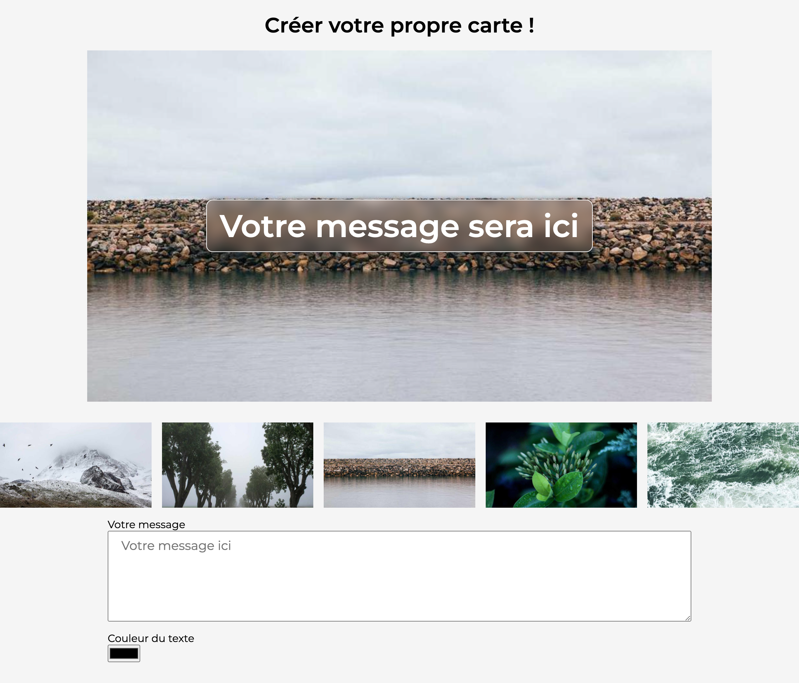
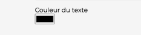

# Crédits

Vous pouvez retrouver le repo original à cette adresse :
[WCS_livedemo-dom](https://github.com/GorskiAnthony/WCS_livedemo-dom)

> Merci [Anthony Gorski](https://github.com/GorskiAnthony/) <3

# Manipulation du DOM

Ce projet est un exemple de manipulation du DOM avec JavaScript.

## Comment ça marche ?

Comme vous pouvez le voir, il y a un fichier `index.html` & `style.css` qui sont déjà fournis. Vous n'avez pas à vous en occuper.

Votre but, c'est de modifier le fichier `index.js` pour que le site fonctionne comme il faut.

Nous allons, bien sûr, vous guider dans ce projet.

## Challenge 1

>Le texte présent dans la zone de saisie "Votre message" doit être affiché dans le titre.

## Challenge 2

>En cliquant sur l'une des 5 images présentes, cette dernière doit être affiché en tant qu'image de fond de votre texte précèdemment modifié.

## Challenge 3

>En bas de page, un sélecteur est à votre disposition pour modifier la couleur de votre texte. A vous de mettre en place la logique.

Bon courage ! 🔥
